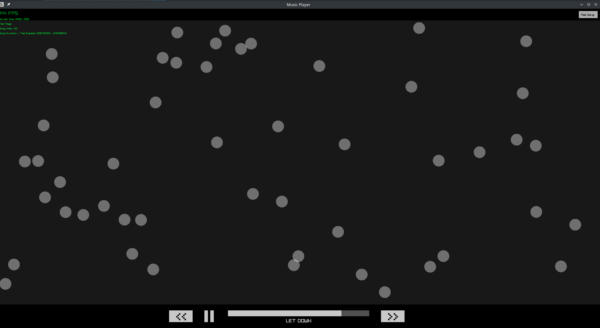

# My Music Player

A simple music player that plays music you upload from your machine. Currently being tested on Manjaro Linux, but should
be operational on other Operating Systems.

Utilises Raylib and PostgreSQL C APIs.

## Planned Features:

- capacity to create playlists of songs
- capacity to signify artists and albums
- shuffle play feature
- ability to play mp4 videos along with songs
- optimise the application